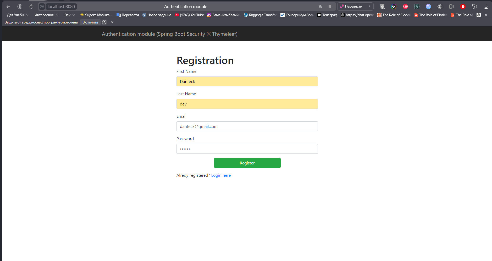
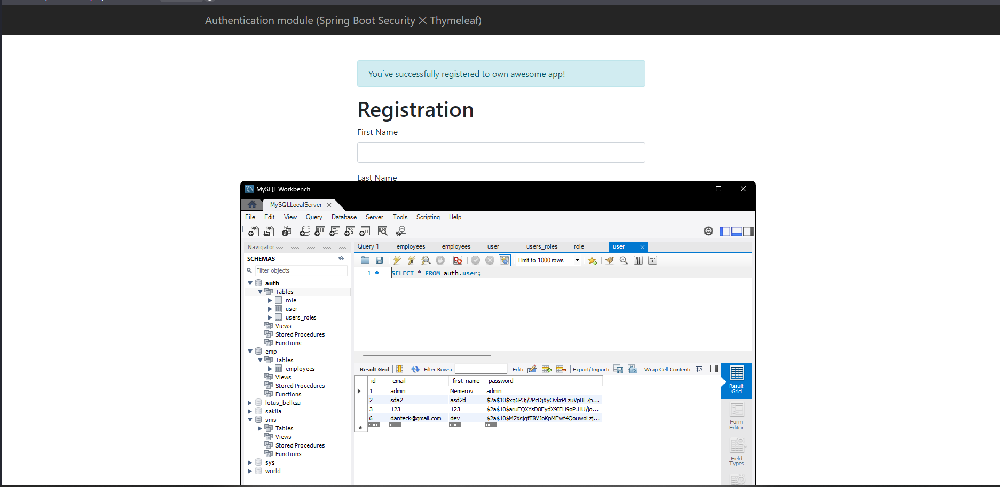
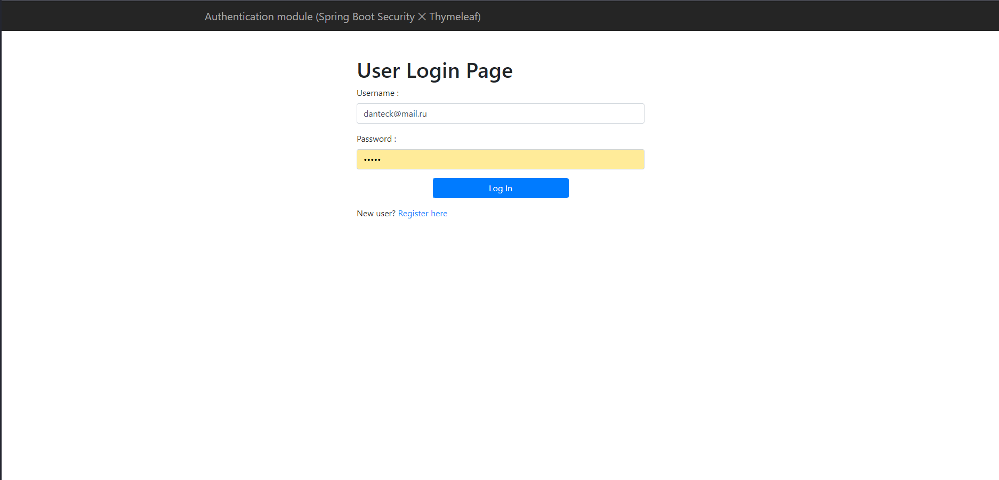
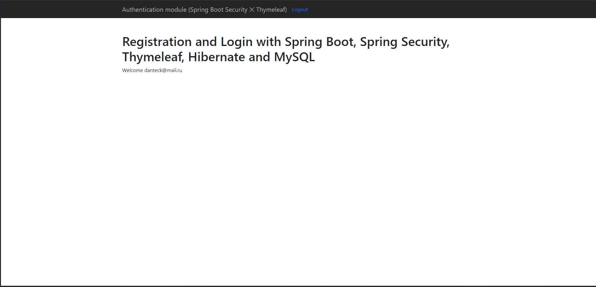

# Auth Module Spring Boot Thymeleaf

## Описание

Приложение реализует систему регистрации и авторизации пользователей с использованием **Spring Boot**, **Spring Security**, **Hibernate**, **Thymeleaf** и **MySQL**. 

Функционал включает:
- Регистрацию новых пользователей.
- Вход в систему с проверкой учетных данных.
- Использование Spring Security для защиты страниц.

## Стек технологий

- **Backend**: Spring Boot 3.4.1, Spring Security, Hibernate.
- **Frontend**: Thymeleaf.
- **Database**: MySQL.
- **Сборка**: Maven.

## Установка и запуск

1. **Клонирование репозитория**:
   ```bash
   git clone https://github.com/your-repo/auth-module-spring-thymeleaf.git
   cd auth-module-spring-thymeleaf
   ```

2. **Настройка базы данных**:
    - Создайте базу данных MySQL.
    - Обновите файл `application.properties` в папке `src/main/resources`:
      ```properties
      spring.datasource.url=jdbc:mysql://localhost:3306/your_database_name
      spring.datasource.username=your_username
      spring.datasource.password=your_password
      spring.jpa.hibernate.ddl-auto=update
      ```

3. **Сборка проекта**:
   ```bash
   mvn clean install
   ```

4. **Запуск приложения**:
   ```bash
   mvn spring-boot:run
   ```

5. **Доступ к приложению**:
   Откройте в браузере: [http://localhost:8080](http://localhost:8080)

## Основные URL

- `/register` - Регистрация нового пользователя.
- `/login` - Вход в систему.
- `/home` - Главная страница (доступна только для авторизованных пользователей).

## Структура проекта

- **Controller**: Обработка запросов и управление потоками данных.
- **Service**: Логика обработки данных.
- **Repository**: Взаимодействие с базой данных.
- **Templates**: Thymeleaf-шаблоны для отображения страниц.

## Зависимости

Список ключевых зависимостей (полный список в `pom.xml`):
- Spring Boot Starter Data JPA
- Spring Boot Starter Security
- Spring Boot Starter Thymeleaf
- MySQL Connector
- Thymeleaf Extras Spring Security

## Скриншоты
### Главная страница регистрации


### Успешная регистрация 


### Страница входа


### Страничка пользователя


### Автор
- Cтудент **Александр Немеров**
- Вуз **ВСГУТУ**
- Группа **Б761-2**
- Связь **lol@kek-work.ru**

### Лицензия
Проект распространяется под лицензией [MIT LICENSE](LICENSE).
